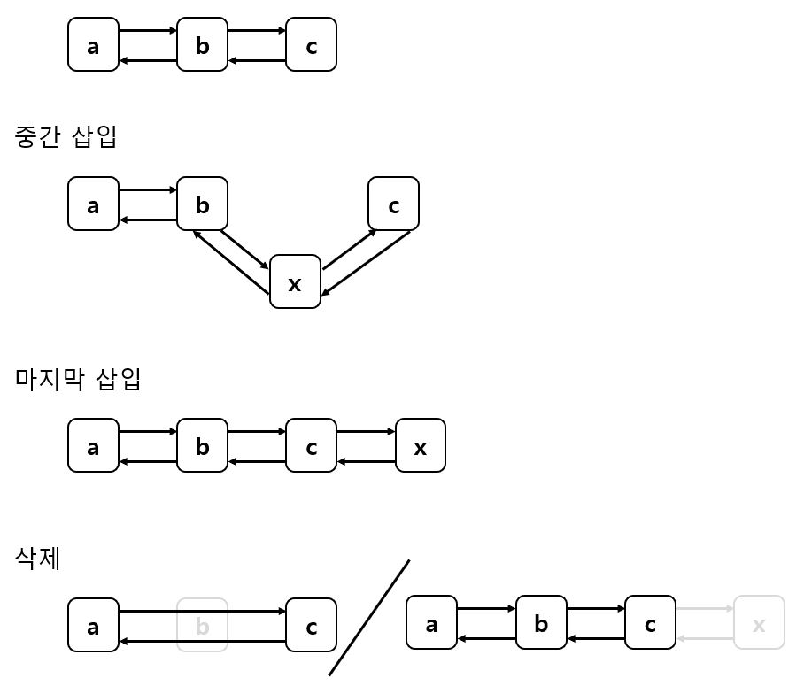
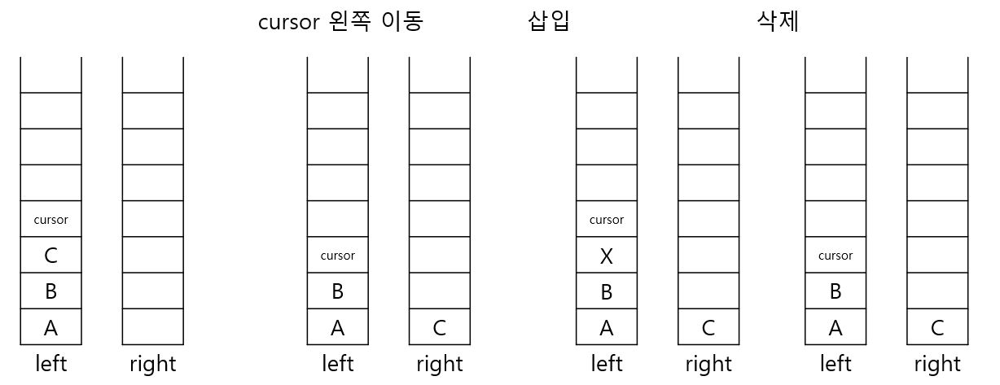

# Editor (백준 - 1406번)
[문제 링크](https://www.acmicpc.net/problem/1406)   

## 문제점
처음에 생각한 아이디어는 ArrayList를 이용한 방법이었다. 아래 그림이 내가 생각한
ArrayList의 동작 방식이라고 생각했다.


구현한 코드는 정상적으로 작동하지만, 시간 초과가 나왔다. 당연히도 ArrayList의
동작 방식은 내가 상각한 것처럼 Link가 아닌 말 그래도 Array이기 때문이다.   
내부 로직에 주어진 길이를 넘어가면 `Arrays.copyOf` 메서드가 호출되고 중간 삽입인
`add(int index, E element)`를 호출하면 `System.arraycopy` 메서드가 작동한다. 이러한 
동작들은 오래 걸리는 작업이기 떄문에 당연히 시간 초과가 발생한다.

## 해결방법
Link 연결도 있지만 Stack을 이용하면 더 빠르게 동작하는 알고리즘을 구현할 수 있다.


왼쪽 스택의 제일 위를 cursor로 보고 진행하면 처음에 사용한 ArrayList보다 훨씬 빠르게
알고리즘을 구현할 수가 있다. 아래는 내가 구현한 코드의 일부다.

```java
public class Editor {

    private Stack<String> leftStack;
    private Stack<String> rightStack;

    public Editor(String text) {
        this.leftStack = new Stack<>();
        this.rightStack = new Stack<>();

        for(int i=0; i<text.length(); i++){
            this.leftStack.push(String.valueOf(text.charAt(i)));
        }
    }

    public void moveLeft(){
        if(!leftStack.isEmpty()){
            rightStack.push(leftStack.pop());
        }
    }

    public void moveRight(){
        if(!rightStack.isEmpty()){
            leftStack.push(rightStack.pop());
        }
    }

    public void delete(){
        if(!leftStack.isEmpty()){
            leftStack.pop();
        }
    }

    public void insert(String word){
        leftStack.push(word);
    }

    public String getText() {
        StringBuilder sb = new StringBuilder();
        while(!leftStack.isEmpty()){
            rightStack.push(leftStack.pop());
        }

        while(!rightStack.isEmpty()){
            sb.append(rightStack.pop());
        }

        return sb.toString();
    }
}
```

## 내가 놓친 부분
1. 문제의 의도(?)를 파악하지 못한 것   
해당 문제는 명령을 다 수행하고 마지막 결과만 보여주면 되는 문제다. 즉, 커서의
이동과 커서에서의 작업을 빠르게 구현하기만 하면 된다. Linked List처럼 구현해도 될지는
추후에 Linked List로 구현 확인하는 걸로   

2. 정확한 자료구조의 내부 구조를 모르고 사용하는 것   
처음에 언급했듯이 의도는 Linked List였지만, 사용한 자료구조는 `ArrayList`였다.
자료구조를 사용하기 이전에 해당 자료구조가 대충이라도 어떻게 동작하는지 알고 사용하자.

   
---
### 참고 
[내 github](https://github.com/yoonjaeSong/Algorithm/blob/master/src/main/java/com/raccon/backjoon/editor/Editor.java)   
[juhyun7793님의 아이디어 참고](https://velog.io/@juhyun7793/%EC%8A%A4%ED%83%9D-f9k4p3sgau)